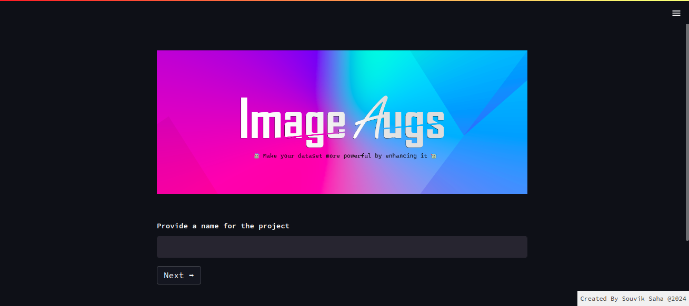
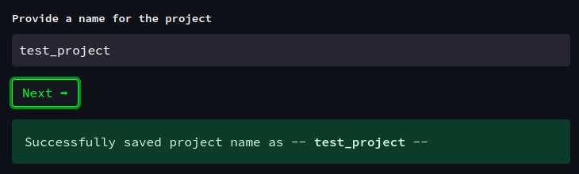
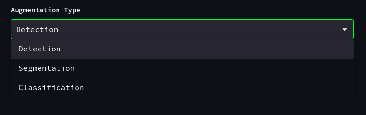
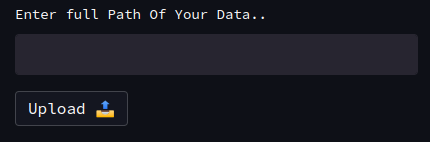
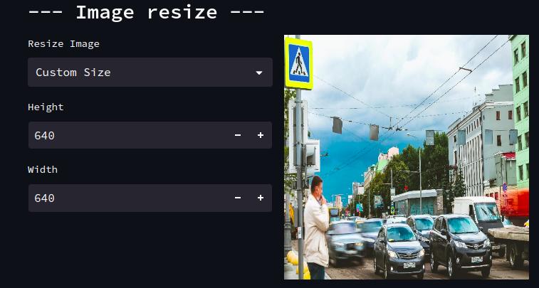
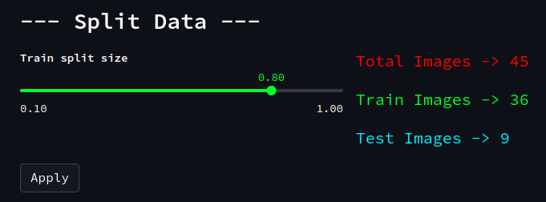
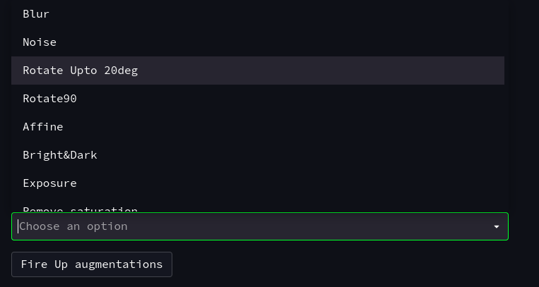
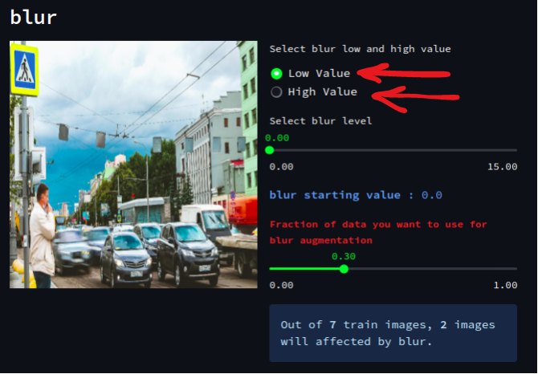

# Image Augmentations 🚀
***


***


***
##  ℹ️ Description:

This is a augemntation tool for Object Detection , Image classification and Instance Segmentation , it can perform 12+ annotations. The important ones are rotation, affine, zooming in and out, noise, and blur. The augmentations can be applied to a fraction of the data (40 - 50 percent of the images out of 100 can be augmented).When rotating or zooming in and out, the bounding box coordinates will also change as the image is rotated or zoomed.

***
##  🚀 Let's Start.. 
#### 👩🏼‍💻 Create a virtual environment (OPTIONAL)

```python
pip install virtualenv
python3 -m venv <your env name>

#activate the environment --> for linux user
source <your env name>/bin/activate

#activate the environment  --> for windows user
<your env name>/Source/activate.ps1
```

#### 👩🏼‍💻 Clone the repository ⤵️
```python
git clone https://github.com/Souviksaha1998/Image_Augs.git
cd Image_Augs
```
#### 🚀 Install the requirements.txt file
```python
pip install -r requirements.txt
```

#### 🎯 Next run this..
```python
streamlit run app.py
```
#### You'll able to see a inferface like this ⤵️


## Steps to follow ⤵️


**Provide a name for the project and click on --***Next***-- and you will see a --***SUCCESS***-- message**




**Select project type ***(FOR NOW ONLY SUPPORTED PROJECT TYPE IS --DETECTION--)*** and click on CONTINUE.**



**You need to provide ***FULL PATH*** of the data ***(RELATIVE PATH WON'T WORK)*****



**Resize Image**



**Split into train and test dataset, You will able to see ***TOTAL IMAGES , TRAIN IMAGES , TEST IMAGES*** in numbers.**



**Select augmentations you want to apply on your images and click ***FIRE UP AUGMENTATIONS*****




    - LOW VALUE        -> STARTING VALUE OF AN AUGMENTATION.
    - HIGH VALUE       -> ENDING VALUE OF AUGMENTATION, YOU MUST SELECT A VALUE (LOW TO HIGH WILL ACT AS A RANGE).
    - FRACTION OF DATA -> YOU SELECTED 0.30 MEANS OUT OF 100 IMAGES RANDOM 30% DATA YOU WILL BE SELECTED FOR A PARTICULAR AUGMENTATION.
    - INFO             -> YOU WILL ABLE TO SEE, OUT OF TOTAL TRAIN IMAGES HOW MANY IMAGES WILL BE AFFECTED BY A PARTICULAR AUGMENTATION.
    
### 🚀 Next, click on - *AUGMENT DATA* -
***

## Feedback, Bug Reports, and Support

Your feedback is invaluable for improving this augmentation tool! If you encounter any issues, have suggestions for new features, or just want to share your experience, please don't hesitate to reach out. Here's how you can get in touch:

### Opening Issues

If you come across a bug or have a feature request, please open an issue on the [GitHub repository](https://github.com/Souviksaha1998/Image_Augs/issues). When opening an issue, try to provide as much detail as possible, including steps to reproduce the problem and any error messages you encountered. This will help us quickly understand and address the issue.


### Contributing

We welcome contributions from the community! Whether it's fixing bugs, adding new features, or improving documentation, your contributions help make this tool better for everyone.

Thank you for your support and contributions!

## License
[MIT](https://choosealicense.com/licenses/mit/)


